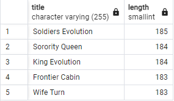
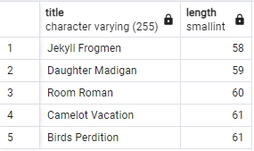
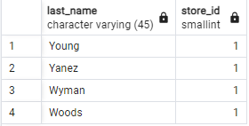

1. SELECT title, length FROM film
   WHERE title ILIKE ('%n')
   ORDER BY length DESC
   LIMIT 5;

   

2. SELECT title, length FROM film
   WHERE title ILIKE ('%n')
   ORDER BY length ASC
   OFFSET 5
   LIMIT 5;

   

3. SELECT last_name, store_id FROM customer
   WHERE store_id = 1
   ORDER BY last_name DESC
   LIMIT 4;

   